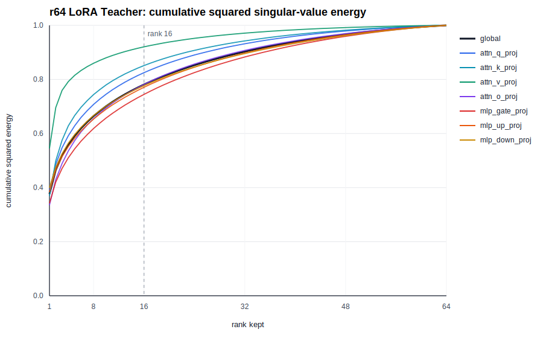

# Parameter Golf TextVQA Report Draft

## 0. Task & Protocol

This report studies PEFT adaptation of `Qwen/Qwen3-VL-2B-Instruct` on TextVQA under a lightweight-submission protocol. I compare all methods against a locally reproduced README baseline and report validation exact match, adapter size, training time, and merged-model evaluation time.

Unless otherwise stated, experiments use 1024 steps, global batch size 16, `max_pixels=200704/min_pixels=100352`, and question-aware top-16 OCR prompts. Most ablations are seed-1 controlled comparisons; the baseline and final method are repeated over three seeds. All timings below are local measurements on 2x RTX 4090 for training and are compared against the reproduced local baseline under the same recipe.

| Item | Setting |
|---|---|
| Base model | `Qwen/Qwen3-VL-2B-Instruct` |
| Dataset | TextVQA train/val from local HF parquet cache |
| Main metric | TextVQA validation exact match |
| Submitted weights | PEFT adapter only; no full base model weights |
| Main train recipe | 1024 steps, global batch size 16 |
| Image budget | `max_pixels=200704`, `min_pixels=100352` |
| Main eval recipe | merge adapter, then evaluate the merged model |

Small single-seed gaps should be interpreted with the observed seed variation in mind, roughly `0.2-0.3 pp` EM for the repeated baseline/final runs.

## 1. Main Results vs Baseline

The table separates seed-1 results from 3-seed means. This avoids treating exploratory single-seed improvements as equally robust as repeated results.

| Method | Seed1 EM | 3-seed mean EM | Adapter weight file | Train / extra cost | Claim |
|---|---:|---:|---:|---:|---|
| README baseline, LM LoRA r16, no OCR tokens | `0.71340` | `0.71255` | about `69.8 MB` | `58-59 min` | Local baseline reproduced |
| OCR qaware16 + LM LoRA r16 | `0.73248` | not run | about `69.8 MB` | `58:25` | OCR tokens are the largest single gain |
| OCR qaware16 + full-LM rsLoRA r32 alpha16 | `0.73824` | not run | about `139.5 MB` | `59:10` | Strong seed-1 rank-scaling result |
| OCR qaware16 + full-LM rsLoRA r64 alpha24 teacher | `0.74074` | `0.74211` | `278,979,768` bytes | `58-59 min` | Strong repeated teacher |
| r64 teacher -> uniform SVD r16 | `0.73970` | `0.74166` | `69,788,264` bytes | SVD `3-6 sec` | Final compact method |

On seed1, r64 improves over r32 by `+0.250 pp`, so the r32-to-r64 comparison alone is not the main claim. The stronger result is compression: the r64 teacher compressed to r16 reaches `0.74166` mean EM, losing only `0.045 pp` from the r64 teacher mean while reducing the adapter weight file by about 4x.

For readability, I summarize the completed seed-1 component changes below.

| Step | Controlled change | EM | Delta vs previous | Adapter / cost note |
|---:|---|---:|---:|---|
| 0 | README baseline: LM LoRA r16, no OCR | `0.71340` | - | about `69.8 MB`, `58-59 min` |
| 1 | Add question-aware top-16 OCR tokens, keep r16 LoRA | `0.73248` | `+1.908 pp` | same adapter size |
| 2 | Increase LM adapter capacity to rsLoRA r32 alpha16 | `0.73824` | `+0.576 pp` | about `139.5 MB`, train still about `59 min` |
| 3 | Train a stronger rsLoRA r64 alpha24 teacher | `0.74074` | `+0.250 pp` | about `279.0 MB`, used only as teacher |
| 4 | Compress r64 teacher to uniform SVD r16 | `0.73970` | `-0.104 pp` | back to `69.8 MB`; compression `3-6 sec` |

The largest gain comes from OCR evidence, while high-rank training adds a smaller adaptation gain. SVD compression preserves almost all of the high-rank gain with a compact rank-16 adapter.

## 2. PEFT Capacity Study

This section asks where adaptation capacity should be placed before changing rank. All rows use OCR qaware16, 1024 steps, and seed1. These are exploratory ablations; the MLP-only vs attention-only gap is suggestive, not a 3-seed statistical claim.

| Method | Target modules | Trainable params | EM | Train wall | Interpretation |
|---|---|---:|---:|---:|---|
| Attention-only r16 | LM `q,k,v,o` projections | `6.42M` | `0.72560` | `49:49` | Insufficient by itself |
| MLP-only r16 | LM `gate,up,down` projections | `11.01M` | `0.73116` | `43:15` | Captures much of the TextVQA gain |
| Full LM r16 | LM attention + MLP | `17.43M` | `0.73248` | `58:25` | Default target set |
| LM + projector r16 | Full LM + multimodal projector | `17.66M` | `0.73082` | `1:00:46` | No evidence that projector LoRA helps |
| LM + vision-last4 r16 | Full LM + last 4 vision blocks | `18.48M` | `0.73512` | `1:04:20` | Improves EM but exceeds the local one-hour budget |

The main signal is that attention-only adaptation is insufficient, while MLP-side adaptation captures much of the TextVQA gain. Therefore, I use full LM attention+MLP as the default target set for rank scaling and compression. Other PEFT variants such as DoRA were not selected because they did not improve EM and were substantially slower; details are in the appendix.

I also observed a positive but budget-risky signal from adding vision-last4 LoRA to the r64 LM adapter: it reached `0.74376` on seed1 but took `1:02:54` on 2x RTX 4090 and was not repeated or compressed. I therefore treat it as evidence that vision-side adaptation may help, not as a final candidate.

## 3. Train High, Compress Down

The selected method uses the high-rank adapter as a training-time teacher and submits a compressed rank-16 adapter.

### 3.1 Rank Scaling and High-Rank Teacher

Rank scaling in Table 1 shows that increasing the LM rsLoRA rank from 16 to 32/64 improves seed-1 EM, and r64 gives the strongest repeated teacher. I therefore use r64 only as a training-time teacher, not as the submitted adapter.

### 3.2 Post-Training SVD Compression

For each LoRA module, I compress the effective update `Delta W = s * B @ A`, rather than approximating `A` and `B` separately. The script computes a rank-k approximation of `B @ A` using a QR-reduced small SVD, then refactors the top-k singular components into new LoRA `A/B` matrices while absorbing the old/new rsLoRA scaling ratio. This preserves the merged update as closely as possible under the target rank.

The cumulative spectrum is shown below.



| Rank kept | Global squared energy kept |
|---:|---:|
| 4 | `0.55890` |
| 8 | `0.66443` |
| 16 | `0.78119` |
| 32 | `0.90298` |
| 48 | `0.96691` |

The rank-16 approximation keeps `78.12%` of global squared singular-value energy and almost all downstream EM. This supports the main hypothesis: the learned rank-64 LoRA products contain substantial low-rank redundancy, and many discarded directions are either behaviorally weak for TextVQA or redundant with directions kept in other modules.

| Method | Seed1 EM | 3-seed mean EM | Energy kept | Adapter weight file | Conclusion |
|---|---:|---:|---:|---:|---|
| r32 -> SVD r16 | `0.73698` | not run | `0.91107` from r32 | `69,788,264` bytes | Compression works, but teacher is weaker |
| r64 -> SVD r32 | `0.73998` | not run | `0.90298` from r64 | `139,518,856` bytes | Almost teacher-level, larger than needed |
| r64 -> SVD r16 | `0.73970` | `0.74166` | `0.78119` from r64 | `69,788,264` bytes | Best compact method |

The fact that `r64 -> SVD r16` beats `r32 -> SVD r16` suggests that high-rank training finds a better update subspace even when the final adapter budget is the same.

### 3.3 Alternative Allocation Strategies

I tested whether more sophisticated rank allocation can beat uniform per-module SVD at the same r16-sized adapter budget.

| Method | Allocation signal | EM | Budget / size | Takeaway |
|---|---|---:|---:|---|
| Uniform SVD r16 | Uniform post-hoc rank | `0.73970` seed1, `0.74166` mean | `69.8 MB` weight file | Final method |
| Energy-budget r16 | Singular-value energy | `0.73884` | `69.8 MB` weight file | Higher spectral energy does not translate to higher EM |
| SNR-guided selective r16 | 200-batch gradient SNR probe | `0.73418` | `17.43M` trainable params | Better than direct r16, below teacher-SVD |
| AdaLoRA init32 target16 | Training-time adaptive rank | `0.70076` | `134 MB` adapter weight file | Underperformed under the 1024-step VLM SFT setting |

Energy allocation and SNR allocation behave very differently. Energy allocation favors MLP `gate/up` and compresses `v/down` aggressively; SNR allocation heavily favors attention. This contrast supports the main lesson: neither raw spectral energy nor a short gradient probe is sufficient to replace high-rank training followed by SVD compression.

| Allocation | Favors | Under-allocates | Result |
|---|---|---|---|
| Energy-budget | `gate_proj/up_proj` | `v_proj/down_proj` | More retained energy, lower EM than uniform SVD |
| SNR-guided | attention projections | `gate_proj/up_proj` | Improves direct r16, does not close the gap to teacher-SVD |

AdaLoRA was tested as the training-time adaptive-rank counterpart to post-training SVD allocation. Under the corrected short SFT recipe, it reached only `0.70076` and produced a larger-than-intended adapter. I therefore treat it as a negative control: dynamic rank reallocation was not stable or cost-effective in this 1024-step VLM fine-tuning setting.

## 4. Final Method

Final recipe:

1. Prepare TextVQA with question-aware top-16 OCR tokens.
2. Train full-LM rsLoRA on language attention + MLP modules:
   - `r=64`
   - `alpha=24`
   - `max_steps=1024`
   - global batch size `16`
   - image budget `200704 / 100352`
3. Compress the trained adapter by per-module SVD:
   - output rank `16`
   - output alpha `16`
   - rsLoRA enabled
4. Merge only for local evaluation. Submit only the compressed PEFT adapter.

Final multi-seed result:

| Seed | Baseline EM | r64 teacher EM | r64 -> SVD r16 EM | SVD gap vs teacher |
|---:|---:|---:|---:|---:|
| 1 | `0.71340` | `0.74074` | `0.73970` | `-0.104 pp` |
| 2 | `0.71426` | `0.73990` | `0.74114` | `+0.124 pp` |
| 3 | `0.71000` | `0.74570` | `0.74414` | `-0.156 pp` |
| Mean | `0.71255` | `0.74211` | `0.74166` | `-0.045 pp` |

Final artifact size:

| Artifact | Size / params |
|---|---:|
| `adapter_model.safetensors` | `69,788,264` bytes |
| Adapter directory | about `82 MB` |
| Direct r16 trainable params equivalent | `17,432,576` |
| r64 teacher trainable params | `69,730,304` |
| r64 teacher `adapter_model.safetensors` | `278,979,768` bytes |

Component sanity checks on seed1:

| Ablation | EM | What it shows |
|---|---:|---|
| Final r64 -> SVD r16 | `0.73970` | Main compact method |
| Remove OCR from r64 -> SVD r16 | `0.72164` | OCR is essential for TextVQA |
| Train r16 directly instead of teacher-SVD | `0.73248` | High-rank teacher provides a better update |
| Keep r64 uncompressed | `0.74074` | Compression costs only `0.104 pp` on seed1 |
| r32 -> SVD r16 | `0.73698` | Stronger teacher compresses better |
| Energy-budget r16 instead of uniform SVD | `0.73884` | More singular-value energy did not improve EM |

I select `r64 -> uniform SVD r16` as the main method because it is compact, repeated over three seeds, and compatible with merged-model inference.

## 5. Remaining Errors and Limitations

I sampled and categorized wrong or partially correct validation cases from the seed1 final method. The goal was to understand whether remaining errors are mainly adapter-capacity problems or data/grounding problems.

| Error type | Count | Interpretation | Possible future direction |
|---|---:|---|---|
| Partial / ambiguous GT | `614` | Prediction is close to one valid answer variant but not exact | Multi-answer training or more careful normalization |
| Visual or OCR absent | `320` | Required evidence is not available in selected OCR or visual crop | Better OCR or visual grounding |
| Near-miss specificity | `298` | Correct region or entity type, wrong granularity | Structured OCR evidence and answer-type guidance |
| Numeric/date/count | `247` | Exact-format sensitive errors | Type-aware normalization or targeted numeric training |
| Copy/choice failure | `170` | Relevant OCR exists but the wrong token is chosen | OCR-choice training or carefully filtered preference data |
| OCR selection miss | `29` | qaware16 misses gold OCR evidence | Hybrid OCR selection |

This distribution explains why simply increasing LoRA rank or switching to more advanced PEFT methods gives diminishing returns: many remaining cases are caused by OCR noise, answer normalization, or annotation ambiguity rather than adapter capacity alone.

The main hardware limitation is that I did not have access to a 2080Ti server. I therefore reproduced the README baseline locally on 2x RTX 4090 and used the measured local baseline cost as the reference for later methods. Final comparison on the official server should use the same submitted scripts and compressed adapter.

## 6. Appendix

### Reproducibility Paths

| Purpose | Path |
|---|---|
| Teacher config | `configs/experiments/peft_full_rslora_r64_alpha24.yaml` |
| SVD compression script | `compress_lora_svd.py` |
| Training launcher | `scripts/run_one_peft_experiment.sh` |
| Eval task | `lmms-eval/lmms_eval/tasks/textvqa/textvqa_val_ocr_qaware16.yaml` |
| SVD spectrum figure | `report_assets/r64_svd_cumulative_energy.svg` |

### SVD Compression Details

For source rank `r_old` and compressed rank `r_new`, rsLoRA scaling is:

```text
s_old = alpha_old / sqrt(r_old)
s_new = alpha_new / sqrt(r_new)
Delta W_old = s_old * B_old @ A_old
```

The compression computes a low-rank approximation of `D = B_old @ A_old` and folds the scaling ratio into the new factors:

```text
D ~= U_k Sigma_k V_k^T
B_new = U_k * sqrt(Sigma_k * s_old / s_new)
A_new = sqrt(Sigma_k * s_old / s_new) * V_k^T
Delta W_new = s_new * B_new @ A_new ~= Delta W_old
```

For the final compression, the source is `r64 alpha24`, so `s_old=24/sqrt(64)=3.0`. The compressed adapter uses `r16 alpha16`, so `s_new=16/sqrt(16)=4.0`. The scaling ratio is absorbed into the factors, so changing alpha does not change the represented merged delta after refactor.

### Allocation Details

Energy-budget r16 used `17,424,384` LoRA parameters versus the uniform r16 budget of `17,432,576`, equivalent to rank `15.99`.

| Family | Mean rank under energy budget | Min | Max |
|---|---:|---:|---:|
| `mlp_gate_proj` | `25.29` | 16 | 36 |
| `mlp_up_proj` | `23.43` | 16 | 32 |
| `attn_o_proj` | `16.00` | 12 | 20 |
| `attn_q_proj` | `13.14` | 8 | 16 |
| `attn_k_proj` | `8.43` | 4 | 12 |
| `mlp_down_proj` | `7.43` | 4 | 8 |
| `attn_v_proj` | `5.57` | 4 | 8 |

The SNR probe used LoRA `r=4`, `alpha=8`, rsLoRA, learning rate `1e-5`, the same OCR/resolution/data protocol, and 200 training batches. For each target module, it accumulated:

```text
score(module) = ||mean(grad)|| / (||std(grad)|| + eps)
```

Ranks were assigned under the same uniform-r16 parameter budget (`17,432,576` LoRA parameters), with rank range `4-32`, multiple-of-4 rounding, and floors `v_proj=8`, `o_proj=8`, `down_proj=8`. The generated config scales `alpha_i ~= 4 * sqrt(rank_i)` so rsLoRA scaling stays close to the uniform r16 setting.

| Family | Count | Mean rank | Mean SNR |
|---|---:|---:|---:|
| `attn_q_proj` | 28 | `32.00` | `0.104108` |
| `attn_k_proj` | 28 | `32.00` | `0.103173` |
| `attn_v_proj` | 28 | `32.00` | `0.118356` |
| `attn_o_proj` | 28 | `32.00` | `0.110120` |
| `mlp_down_proj` | 28 | `10.57` | `0.113371` |
| `mlp_gate_proj` | 28 | `5.00` | `0.107274` |
| `mlp_up_proj` | 28 | `4.43` | `0.109661` |

### Additional PEFT Variants

| Method | EM | Train wall | Adapter / params | Conclusion |
|---|---:|---:|---:|---|
| Full-LM DoRA r16 | `0.73208` | `1:33:13` | `18.01M` trainable, about `84 MB` directory | Not selected; slower without EM gain |
| r64 LM + vision-last4 r16 | `0.74376` | `1:02:54` | about `286 MB` directory | Promising but budget-risky and not repeated/compressed |
| MLP r32 rsLoRA + vision-last4 r16 | `0.73650` | `48:09` train stage | larger than r16 | Not additive enough to replace full-LM teacher-SVD |

AdaLoRA implementation details: the initial implementation exposed PEFT serialization issues because `rank_pattern` may contain tensor/boolean-mask structures that are not directly JSON serializable in the logging path. After using JSON-safe logging and a more stable setting (`init_r=32`, `target_r=16`, `tinit=128`, `tfinal=128`, `deltaT=8`, `alpha=96`, `orth_reg_weight=0.05`), the run completed but underperformed.

### Full OCR Ablation

All OCR experiments use the original LM LoRA r16 baseline setting with seed1.

| OCR policy | EM | Delta vs no-OCR seed1 | Eval gen time | Train wall |
|---|---:|---:|---:|---:|
| No OCR | `0.71340` | - | `1120.464s` | about `58-59 min` |
| First 8 OCR tokens | `0.72636` | `+1.296 pp` | `1142.683s` | `59:06` |
| First 16 OCR tokens | `0.73284` | `+1.944 pp` | `1156.425s` | `59:49` |
| Unique first 16 OCR tokens | `0.73098` | `+1.758 pp` | `1155.800s` | `58:05` |
| Question-aware top 16 OCR tokens | `0.73248` | `+1.908 pp` | `1139.949s` | `58:25` |

`first16` is slightly higher on seed1, but `qaware16` is essentially tied and better motivated because it prioritizes OCR tokens related to the question rather than only their original order.

### DPO

| Method | Init | EM | Cost | Conclusion |
|---|---|---:|---:|---|
| Naive DPO pilot512 | r64 -> SVD r16 | `0.72738` | collect `18:47`, train `7:06` | Harmful; pushed longer OCR-copy answers |
| Conservative short DPO v2 | r64 -> SVD r16 | `0.73978` | collect `34:38`, train `3:41` | Neutral; fixed drift but no real gain |
| Reference r64 -> SVD r16 | - | `0.73970` | - | Keep as main method |

I avoid using validation errors as training pairs; DPO pairs are generated from the training split. DPO is not selected. The negative-to-neutral progression shows that preference-pair filtering matters, but it does not justify adding another training stage.

### Early Stopping

| Step | EM | Delta vs 1024-step OCR qaware16 |
|---:|---:|---:|
| 256 | `0.72142` | `-1.106 pp` |
| 512 | `0.72578` | `-0.670 pp` |
| 768 | `0.72830` | `-0.418 pp` |
| 1024 | `0.73248` | - |

Early stopping can reduce cost, but 1024 steps remains the safest score-first setting for this benchmark.

### Lower Resolution

| Method | Pixel budget | EM | Decision |
|---|---:|---:|---|
| OCR qaware16 original | `200704 / 100352` | `0.73248` | Keep |
| OCR qaware16 pix150k | `150528 / 75264` | `0.70250` | Large drop |
| OCR qaware16 pix100k | `100352 / 50176` | stopped early | Stopped because the 150k setting already showed a large degradation |

Lowering resolution is not compatible with this TextVQA setting. The score drop suggests the task depends on small visual text regions.
